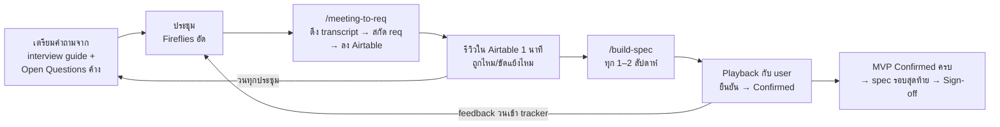

# Requirement Harness Template

โครง workflow สำหรับ **เฟสเก็บ requirement → ทำ spec** ใช้ได้กับโปรเจกต์อะไรก็ได้
หัวใจคือแยก "ที่เก็บ requirement" (Airtable — รายข้อ มี ID/ที่มา/สถานะ) ออกจาก "เอกสาร spec" (generate จาก tracker) — จะได้ไม่เกิดปัญหาแก้ในเอกสารแล้วหลุด track ว่าใครขอ อะไร เมื่อไหร่



## ต้องมีอะไรบ้าง

- **Claude Code** (CLI หรือ desktop app)
- **Airtable** เชื่อมเป็น connector/MCP กับ Claude Code (free tier พอ)
- **Fireflies.ai** เชื่อมเป็น connector/MCP (optional แต่แนะนำ — ไม่มีก็วาง transcript เองได้)

## เริ่มโปรเจกต์ใหม่

1. กด **Use this template** สร้าง repo ใหม่ (หรือ clone แล้วลบ remote)
2. เปิด Claude Code ในโฟลเดอร์นั้น แล้วพิมพ์:
   ```
   /setup-harness
   ```
   ตอบคำถามไม่กี่ข้อ (โปรเจกต์อะไร ใครคือ stakeholder มีเอกสารเดิมให้วิเคราะห์ไหม) ระบบจะ:
   - สร้าง Airtable base 4 ตาราง (Requirements / Meetings / Open Questions / Stakeholders)
   - เขียน `harness.config.json` (IDs ทั้งหมด — skill อื่นอ่านจากไฟล์นี้)
   - seed requirement ตั้งต้นจากเอกสารเดิม (ถ้ามี)
   - generate `docs/interview-guide.md` ตามบริบทโปรเจกต์
3. Commit แล้วเริ่มนัดประชุมได้เลย

## Routine ต่อ 1 รอบประชุม

1. **ก่อนประชุม** — เปิด interview guide + Open Questions ค้างใน Airtable ที่ติดชื่อคนที่จะคุย = agenda
2. **ประชุม** — Fireflies เข้าประชุมตามปกติ ไม่ต้องจด
3. **หลังประชุม** — `/meeting-to-req สรุปประชุมล่าสุด` → requirement เข้า tracker เอง พร้อมเช็คซ้ำ/ขัดแย้งกับของเดิม
4. **รีวิว** — กวาดตาดูใน Airtable 1 นาที (คุณเป็นคนตรวจ ไม่ใช่คนพิมพ์)
5. **ทุก 1–2 สัปดาห์** — `/build-spec` → เอา `docs/spec/functional-spec.md` ไป playback ข้อไหน user ยืนยันเปลี่ยน Status → Confirmed

**จบเฟสเมื่อ**: Open Questions สำคัญตอบครบ + requirement ชุด MVP เป็น Confirmed/Approved ทั้งหมด → `/build-spec` รอบสุดท้ายเป็นเอกสาร sign-off

## สถานะ requirement

`Draft` (สกัดจากประชุม ยังไม่ยืนยัน) → `Confirmed` (user ยืนยันใน playback) → `Approved` (ผ่าน sign-off) → `In Spec` | หรือ `Rejected` (ตัดออก — เก็บไว้กันหยิบกลับมาโดยไม่รู้)

## โครงสร้าง repo

```
harness.config.json              IDs ของ Airtable + ข้อมูลโปรเจกต์ (สร้างโดย /setup-harness)
harness.config.example.json      โครง config ให้ดูเป็นตัวอย่าง
.claude/skills/setup-harness/    bootstrap โปรเจกต์ใหม่
.claude/skills/meeting-to-req/   transcript → requirement ลง Airtable
.claude/skills/build-spec/       tracker → functional spec
docs/interview-guide.template.md โครงคำถามสัมภาษณ์ (ถูก customize ตอน setup)
docs/interview-guide.md          คำถามจริงของโปรเจกต์ (สร้างตอน setup)
docs/spec/                       spec ที่ generate — ผลลัพธ์ของ tracker แก้เนื้อหาต้องแก้ที่ Airtable
```

## หลักการที่ template นี้ยึด

- **Tracker คือ source of truth** — เอกสารทุกฉบับ generate จาก tracker แก้เนื้อหาต้องกลับไปแก้ต้นทาง
- **ทุก requirement มีที่มา** — link กลับไปประชุมที่พูดถึง ดูย้อนได้ว่าใครขอเมื่อไหร่
- **ขัดแย้งไม่เขียนทับ** — คนสองคนพูดต่างกัน = Open Question ให้มนุษย์เคลียร์ ไม่ใช่ให้ AI เลือกเอง
- **Open Questions = agenda** — ประชุมรอบถัดไปมีเป้าเสมอ ไม่ใช่คุยเปะปะ
- **มนุษย์เป็นคนตรวจ ไม่ใช่คนพิมพ์** — AI สกัดและจัดระเบียบ คุณรีวิวและตัดสิน

---

## โปรเจกต์นี้

*(section นี้จะถูกเติมโดย `/setup-harness` — ชื่อโปรเจกต์, ลิงก์ Airtable base, วันที่เริ่ม)*
